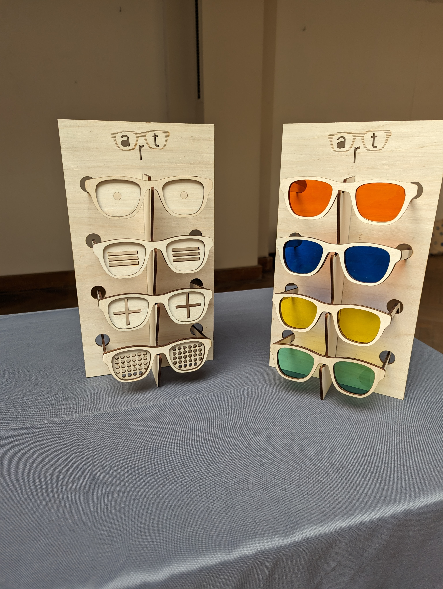

# Les lunettes optic’art, pour voir l’art différemment

Apprentis Scénographes :

Les enfants de 3 écoles ixelloises se sont prêtés au jeu d'imaginer les activités ludiques du Musée d'Ixelles pour sa réouverture en 2025.

Après 3 semaines de création, Lucie et Louise qui encadrent le projet, rejointes par Marie-Ghislaine, scénographe, se sont donné RDV au Fablab'ke pour donner naissance aux idées des enfants. Entre autres, réalisation d'un Qui Est-Ce avec les portraits du Musée, de dés de couleurs, de cartes émotions, de puzzles en bois, de marionnettes du Musée, de lunettes Optic'Art, de sacs de transports pour tous les jeux, ...

[Téléchargez ici](opticart-mode-emploi.pdf) la fiche pour créer les lunettes optic'art pour découvrir l'art différemment.

[Téléchargez ici](lunettes-taille-5-7-ans.svg) le fichier pour la découpe laser.

Ces fichiers sont en Open Source pour une utilisation didactique uniquement.

Un projet en partenariat avec le XLart ASBL et le Musée d'Ixelles.
Soutenu par le Fonds Houtman (O.N.E.), le Commune d'Ixelles et la Fédération Wallonie-Bruxelles.